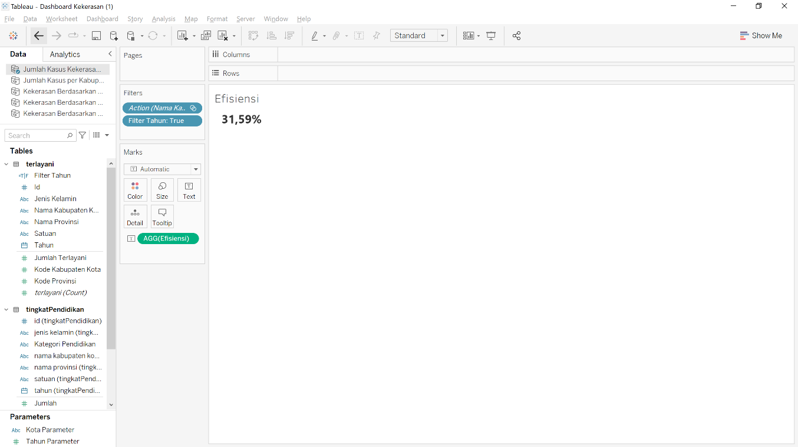

# Dashboard Kekerasan Jawa Barat
## Background


Kekerasan merupakan salah satu kejadian yang menjadi perhatian kepolisian jawa barat. Dari tahun ke tahun, jumlah kasus kenaikan semakin lama semakin naik. 
Asumsi kami, kepolisian daerah dalam menangani fenomena kenaikan jumlah kekerasan akan bertanya pertanyaan sebagai berikut:
-	Daerah mana yang memiliki kenaikan jumlah kekerasan yang tinggi?
-	Bagaimana tren kenaikan kasus kekerasan tiap daerah?
-	Daerah mana yang perlu ditangani lebih dahulu?
-	Korban dari golongan manakan yang paling banyak mengalami kekerasan?
-	Bagaimana efektifitas pengaduan masyarakat?

Ketersediaan data kasus kekerasan di kabupaten kota Jawa Barat dapat membantu kepolisian dalam menangani ataupun mencegah tindakan kekerasan. Namun, data dalam jumlah yang banyak tidak mudah untuk dibaca sehingga sulit untuk mengambil keputusan. Jika kepolisian Jawa Barat ingin memetakan tingkat kasus di setiap kabupaten kota dan memprioritaskan operasi yang akan dijalankan berdasarkan data maka perlu adanya data yang mudah dipahami.
Data yang praktis dan mudah dipahami berupa dashboard, diharapkan dapat membantu memberikan pandangan kepada pihak kepolisian Jawa Barat dalam memetakan tingkat kasus di setiap kabupaten kota sehingga kepolisian bisa memprioritaskan operasi yang akan dijalankan di daerah tersebut dengan efisien dan efektif.

## Objectives
Bagaimana jika terdapat sebuah dashboard yang berisi informasi kenaikan jumlah kasus kekerasan di Jawa Barat. Kepolisian Jawa Barat memiliki kebutuhan task yang perlu diselesaikan (jobs to be done) yaitu:
- Fungsional:
    - Memonitor kondisi kasus kekerasan di kabupaten/kota di jawa barat untuk menentukan prioritas operasi
    - Menentukan pendekatan penanganan kasus yang tepat
    - Mengetahui efesiensi penanganan kasus 
  
-	Emotional:
    -	Merasa bangga terhadap capaian kinerja kepolisian 
  
- Social:
    -	Meningkatan kepercayaan masyarakat terhadap kepolisian

Untuk menjawab kebutuhan tersebut, maka dibutuhkan sebuah dashboard yang berisikan pemetaan dan demografi kasus kekerasan per daerah berdasarkan tahun diharapkan dapat membantu user dalam hal ini kepolisian. Kepolisian dapat memprioritaskan operasi yang akan dijalankan di daerah yang membutuhkan prioritas dengan melihat pemetaan dan demografi yang terdapat dalam dashboard.

## Overview Process
Secara umum, proses pengerjaan adalah sebagai berikut:

__1. Eksplorasi Dataset__

Pada tahapan ini, dilakukan eksplorasi terhadap dataset yang ada. Adapun dataset yang tersedia antara lain:
    -	Data jumlah kasus kekerasan berdasarkan jenis kelamin tiap kota
    -	Data jumlah kasus kekerasan berdasarkan kelompok usia tiap kota
    -	Data jumlah kasus kekerasan berdasarkan pendidikan tiap kota

__2. Menentukan masalah dan persona/user sesuai dengan dashboard yang akan dibuat__

Pada tahapan ini, dibuat user persona sesuai dengan permasalahan dan jawaban dari permasalahan yang dimunculkan.


__3. Menentukan feature yang ada di dalam dashboard yang akan dibuat__

Pada tahapan ini, dilakukan identifikasi fitur yang dapat digunakan untuk menjawab kebutuhan pengguna. Adapun fiturnya antara lain:
-	Peta sebaran kenaikan kasus kriminalitas di setiap kabupaten/kota, dilengkapi filter tahun Chart jumlah korban kasus kekerasan untuk kategori: 
    -	Umur (Bar chart) 
    -	Jenis kelamin (Bar chart) 
    -	Pekerjaan (Bar chart) 
    -	Pendidikan (Bar chart) 
*Difilter berdasarkan kabupaten/kota dengan cara click di maps dan filter tahun 
- KPI rasio jumlah kasus terlayani terhadap kasus terlapor (Difilter berdasarkan kabupaten/kota dengan cara click di maps dan filter tahun) 
-	Time series tren kenaikan kasus kekerasan (berupa tool tip di maps)

__4. Membuat Userflow__

Pada tahapan ini, dibuat sebuah userflow dari kepolisian dengan task memantau jumlah kekerasan di masing-masing kota di Jawa Barat. 


__5. Membuat sketch dan wireframe (Hifi Prototype)__

Setelah memiliki user flow, langkah selanjut nya adalah membuat wireframe. Pada tahap ini kita menyusun informasi apa saja  yang perlu dilihat, dan interaksi apa yang dibutuhkan, untuk membantu pengguna memantau kasus kekerasan di Jawa Barat. Pertama-tama, dibuat sketch untuk memberikan gambaran secara umum informasi yang disajikan.


Setelah itu, dibuatlah hifi mockup yang untuk memberikan gambaran yang lebih nyata terkait dengan dashboard dan tampilan yang dibutuhkan. Pada dashboard utama terdapat informasi peta sebaran signifikansi kenaikan kasus di masing-masing kota di Jawa Barat. Terdapat juga informasi persentase kasus terlayani di setiap daerahnya. Selain itu, terdapat proporsi korban berdasarkan jenis kelamin, pendidikan, usia dan pekerjaan.


Ketika kota pada kota disorot akan tampil tren seperti berikut:


## Data Wrangling dan _Exploratory Data Analysis_

Pada tahapan ini, dilakukan proses eksplorasi data lebih detail untuk mendapatkan gambaran data lebih mendalam. Selain itu, dilakukan juga pembersihan data sehingga data dapat langsung dipakai untuk dashboard.

Pertama-tama, dilakukan import data untuk masing-masing dataset dan filter kolom yang diperlukan.


Selanjutnya, kita melakukan filter kolom untuk mengambil kolom yang diperlukan saja.

```python
usia = usia.iloc[:, :-5]
edu = edu.iloc[:, :-5]
job = job.iloc[:, :-5]
terlayani = terlayani.iloc[:, :-5]
```

Dari tiap dataset, dicoba untuk dicek proporsinya apakah sama dan konsisten. Ternyata, didapatkan, data jumlah laki-laki di tiap dataset sudah sama jumlahnya.


Selanjutnya, dilakukan pengecekan apakah terdapat nilai NaN di masing-masing dataset dan menghapus nama “KABUPATEN” pada kolom `nama_kabupaten_kota`.


Lalu dibutuhkan data growth jumlah kasus setiap tahun yang dihitung dari jumlah kasus tahun sekarang dikurangi tahun lalu, kemudian dibagi dengan jumlah kasus tahun lalu.

```python
(job
 .groupby(["tahun", "nama_kabupaten_kota"])
 .agg({"jumlah_korban":"sum"})
 .reset_index()
 .pivot_table(columns="tahun", index="nama_kabupaten_kota", values="jumlah_korban", aggfunc="sum")
 .reset_index()
 .assign(growth2019=lambda df_: (df_[2019]-df_[2018])/df_[2018]
        ,growth2020=lambda df_: (df_[2020]-df_[2019])/df_[2019]
        ,growth2021=lambda df_: (df_[2021]-df_[2020])/df_[2020])
 .melt(id_vars=["nama_kabupaten_kota"], var_name="growth_cat", value_vars=["growth2019", "growth2020", "growth2021"], value_name="growth_value")
 .assign(tahun=lambda x: x["growth_cat"].str.replace("growth", "").astype(int))
 .drop(columns="growth_cat")
)
```
Hasil dari wrangling di atas diekspor ke file csv digunakan di Tableau.

## Dashboard

Pada tahapan ini dibuatlah dashboard dengan menggunakan tableau. Dashboard ini terdiri dari beberapa sheet yang digabungkan menjadi 1 halaman dashboard. Urutan pengerjaannya sebagai berikut:


Setelah import dataset. Dilakukan pembuatan maps yang berisi tingkat kenaikan jumlah kases kekerasan di tiap daerah (YoY). Data yang digunakan adalah data batas kabupaten/kota digabungkan dengan data jumlah kasus di tiap kota.

Terdapat 3 status yaitu aman, bahaya dan waspada. Penentuan status ditentukan dengan sistem boxplot di mana jika nilai kenaikan berada di atas upper whisker maka berstatus bahaya, antara upper whisker dengan Q3 adalah waspada, dan di bawah Q3 berstatus aman.


Selanjutnya dibuat card yang berisi rasio jumlah kasus terlayani dibandingkan dengan jumlah kasus di masing-masing kota.



Setelah itu dibuat sheet yang berisi jumlah kasus kekerasan berdasarkan jenis kelamin. Chart yang dipakai adalah barchart.


Setelah itu dibuat sheet yang berisi jumlah kasus kekerasan berdasarkan tingkat pendidikan. Chart yang dipakai adalah barchart.


Setelah itu dibuat sheet yang berisi jumlah kasus kekerasan berdasarkan kelompok usia. Chart yang dipakai adalah barchart.


Setelah itu dibuat sheet yang berisi jumlah kasus kekerasan berdasarkan pekerjaan. Chart yang dipakai adalah barchart.


Selanjutnya, dibuat tren kasus per kota yang dapat dibuat untuk tooltip ketika kota pada maps dipilih.


Selanjutnya, seluruh sheet yang sudah dibuat disatukan menjadi satu dashboard dan disesuaikan penggunaan filternya.


Selanjutnya dilakukan publish ke tableau public.


Dashboard: [Link dashboard](https://public.tableau.com/app/profile/helmy.satria/viz/DashboardKekerasan/DashboardKekerasan)

## Analisis

Ada tiga point masalah yang perlu diselesaikan berdasarkan statement masalah yang telah didefinisikan sebelumnya:
-	Menentukan daerah mana yang perlu diprioritaskan untuk menangani kasus kekerasan
-	Treatment apa yang perlu diterapkan untuk menangani kasus kekerasan pada daerah yang diprioritaskan
-	Mengetahui kinerja kepolisian untuk melakukan evaluasi internal

__1. Menentukan daerah prioritas__

Untuk menjawab masalah daerah mana yang perlu diprioritaskan, diperlukan sebuah peta distribusi prioritas. Sebaran daerah prioritas penanganan kasus dibagi berdasarkan 3 kategori: Bahaya, Waspada, dan Aman. Dimana kategori Bahaya perlu diprioritaskan dibandingkan daerah lainnya. Ketiga kategori ini dibuat berdasarkan rasio tingkat kenaikan kasus dengan tahun sebelumnya. Sebagai contoh, pada tahun 2021 status bahaya ada di kabupaten Cianjur. Artinya, kabupaten Cianjur perlu diprioritaskan dibandingkan daerah lainnya. Hal ini disebabkan karena kenaikan kasus di kabupaten Cianjur selama tahun 2020-2021 mengalami kenaikan paling tinggi, dari 2 kasus terlapor di tahun 2020 menjadi 9 kasus di tahun 2021.


User dapat melihat detail kenaikan jumlah kasus kekerasan sepanjang tahun 2018-2021 dengan melakukan hovering di masing-masing daerah. Hal ini dapat memberikan gambaran umum mengenai kasus kekerasan yang harapannya selalu turun sepanjang tahun. Selain itu, data jumlah kasus kekerasan juga dapat memberikan gambaran kepada kepolisian mengenai berapa personil yang perlu dilibatkan dalam satuan yang khusus menangani kasus-kasus kekerasan.

__2. Menentukan treatment yang tepat pada daerah yang diprioritaskan__

Setelah user mengetahui daerah mana yang perlu diprioritaskan, masalah berikutnya adalah bagaimana treatment yang tepat untuk menangani kasus di daerah tersebut. Untuk mengetahui treatment yang tepat, diperlukan proporsi korban kekerasan berdasarkan jenis kelamin, usia, pendidikan, dan pekerjaan. 

Sebagai contoh, pada tahun 2019 di kabupaten Garut, korban kekerasan didominasi oleh perempuan sebanyak 35 orang. Hal ini dapat memberikan gambaran kepada kepolisian terkait aksi apa yang perlu dilakukan, misalnya perlu bekerja sama dengan Komnas Perempuan atau lebih banyak melibatkan polwan agar merasakan sisi empati yang sama. Berdasarkan pendidikan, korban kasus kekerasan didominasi oleh jenjang Pendidikan SLTA. Hal ini dapat memberikan insight kepada kepolisian untuk menerapkan pendekatan yang lebih “remaja”, misalnya. Atau bekerja sama dengan dinas pendidikan setempat. Berdasarkan usia, didapatkan bahwa korban kekerasan didominasi oleh anak-anak hingga remaja antara umur 6-17 tahun. Hal ini juga dapat memberikan insight mengenai pendekatan yang lebih efektif terhadap korban kekerasan di rentang umur tersebut, misalnya dengan melibatkan Komisi Perlindungan Anak. Berdasarkan pekerjaan, korban kekerasan didominasi oleh pelajar. Sama seperti sebelumnya, pendekatan yang mungkin lebih efektif adalah dengan melibatkan kerja sama dengan dinas Pendidikan setempat atau Komisi Perlindungan Anak.


__3. Evaluasi kinerja internal kepolisian__

Untuk evaluasi internal kepolisian, diperlukan suatu KPI yang menunjukkan efesiensi kasus yang dilayani oleh kepolisian. KPI ini didapatkan dari rasio antara jumlah kasus terlayani dibanding kasus terlapor. Dengan adanya KPI, kepolisian dapat mengevaluasi kinerja internal di tingkat kabupaten dan kota. Sebagai contoh, efesiensi pelayanan untuk kabupaten bogor pada tahun 2021 adalah 35,56%.


## Kesimpulan

1.	Penentuan daerah prioritas penanganan kasus korban kekerasan dapat diselesaikan dengan peta sebaran prioritas dengan kategori Bahaya, Waspada, dan Aman.
2.	Treatment yang perlu dilakukan dapat diselesaikan dengan memahami proporsi korban kekerasan berdasarkan jenis kelamin, usia, sendidikan, dan pekerjaan. Karena masing-masing proporsi korban kekerasan memiliki treatment yang berbeda-beda.
3.	Kinerja kepolisian dapat diwakili oleh KPI efesiensi kasus terlayani.

## Pendukung

Sumber data:
1.	SHP Batas Kota dan Kabupaten di Jawa Barat : https://www.indonesia-geospasial.com/
2.	Sumber data kekerasan : https://opendata.jabarprov.go.id/

Sumber gambar :
1.	https://static.republika.co.id/uploads/images/inpicture_slide/ilustrasi-kekerasan-terhadap-perempuan-_191205165712-783.jpg

## Penyusun

1. Ahmad Hawky Dermawan
2. Brian Rizadhani Latuconsina
3. Djatmiko Bagus Maulana Erlambang
4. Helmy Satria Martha Putra
